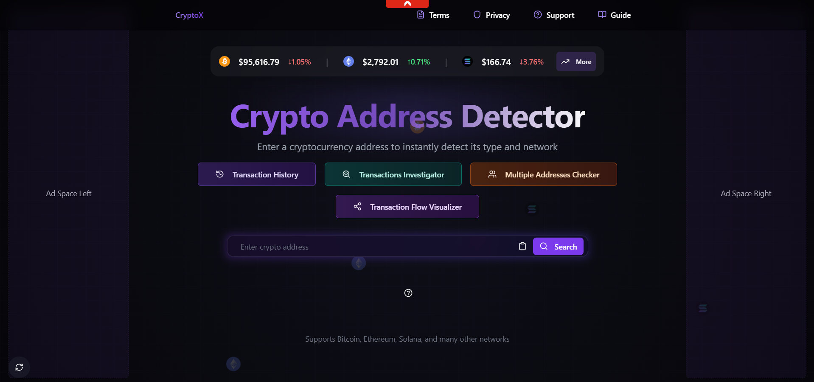

# CryptoX: Crypto Address Detector

## Overview

**CryptoX** is a web-based tool designed to detect and validate cryptocurrency addresses across multiple blockchain networks. Whether you're a developer, trader, or blockchain enthusiast, CryptoX helps you ensure the accuracy and validity of crypto addresses, reducing the risk of errors in transactions. The web version provides an easy-to-use interface accessible from any browser.

## Features

- **Multi-Currency Support**: Detects addresses for major cryptocurrencies like Bitcoin (BTC), Ethereum (ETH), Litecoin (LTC), Ripple (XRP), and more.
- **User-Friendly Interface**: Simple and intuitive design for easy use.
- **Responsive Design**: Works seamlessly on desktop and mobile devices.

## Live Demo

Check out the live version of CryptoX here:  
👉 **[CryptoX Live Demo](https://crypto-address-detector.vercel.app)** 👈

## Installation (For Local Development)

If you'd like to run CryptoX locally or contribute to the project, follow these steps:

### Prerequisites

- Node.js (v16 or higher)
- npm (Node Package Manager)

### Steps

1. Clone the repository:
   ```bash
   git clone https://github.com/yourusername/CryptoX.git
   cd CryptoX

2. Install the required dependencies:
   ```bash
   npm install

3. Start the development server:
   ```bash
   npm run dev

2. Open your browser and navigate to http://localhost:8080 to access the application.



